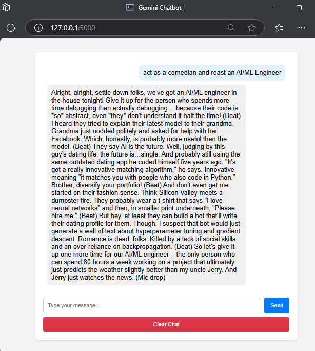
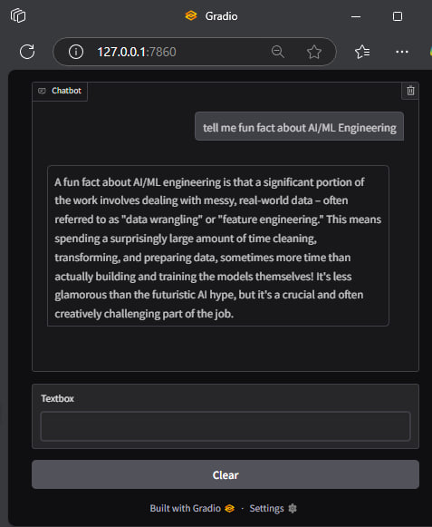

# Gemini Chatbot

Gemini Chatbot is a web-based chatbot application that uses the Gemini API to generate responses to user messages. The application is built using Flask for the backend, Gradio for an alternative frontend, and integrates with the Google Generative AI library.

## Features

- Web-based chat interface using Flask
- Alternative chat interface using Gradio
- Integration with Gemini API for generating responses
- Clear chat history functionality

## Screenshots

### Flask Interface


### Gradio Interface


## Setup Instructions

### Prerequisites

- Python 3.7+
- pip (Python package installer)

### Installation

1. Clone the repository:
    ```sh
    git clone https://github.com/tedoaba/gemini_chatbot.git
    cd gemini_chatbot
    ```

2. Install the required Python packages:
    ```sh
    pip install -r requirements.txt
    ```

3. Create a `.env` file in the root directory and add your Gemini API credentials:
    ```env
    GEMINI_API_KEY=your_gemini_api_key
    GEMINI_ID=your_gemini_model_id
    ```

### Running the Flask App

1. Navigate to the project directory:
    ```sh
    cd gemini_chatbot
    ```

2. Run the Flask application:
    ```sh
    python flask_app.py
    ```

3. Open your web browser and go to `http://127.0.0.1:5000` to access the chat interface.

### Running the Gradio App

1. Navigate to the project directory:
    ```sh
    cd gemini_chatbot
    ```

2. Run the Gradio application:
    ```sh
    python gradio_app.py
    ```

3. Open the provided Gradio link to access the chat interface.

## Usage

- Type your message in the input box and click "Send" to receive a response from the chatbot.
- Click the "Clear Chat" button to clear the chat history.

## Project Structure

```
gemini_chatbot/
├── src/
│   ├── api_client.py
│   ├── chatbot.py
│   └── utils.py
├── static/
│   ├── script.js
│   └── style.css
├── templates/
│   └── index.html
├── flask_app.py
├── gradio_app.py
├── requirements.txt
└── README.md
```

## License

This project is licensed under the MIT License. See the [LICENSE](LICENSE) file for details.